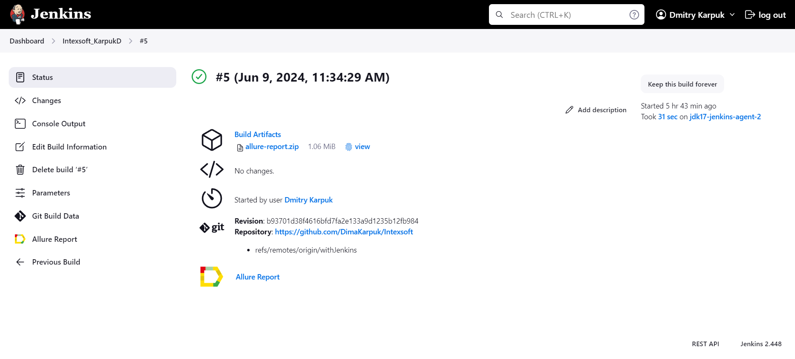
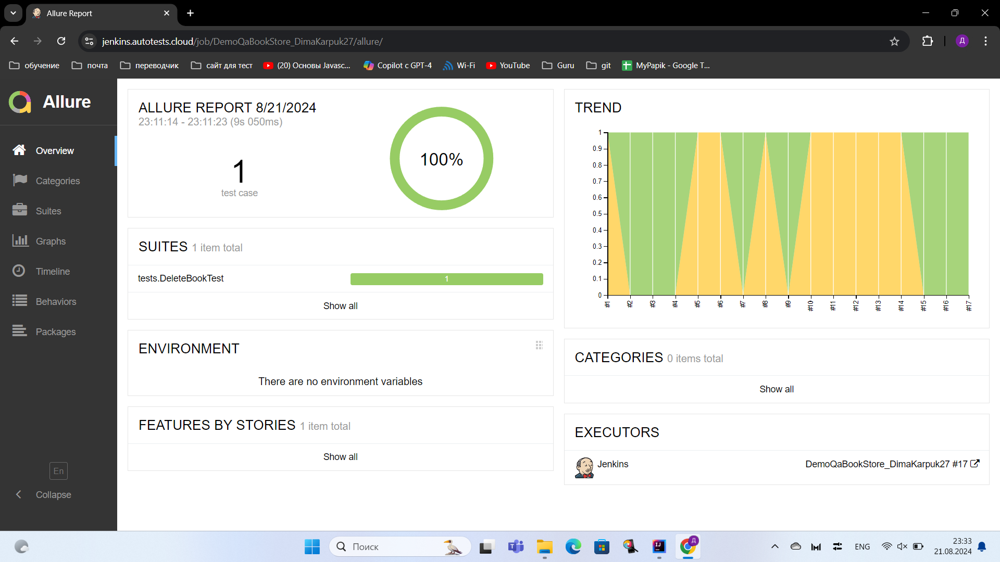
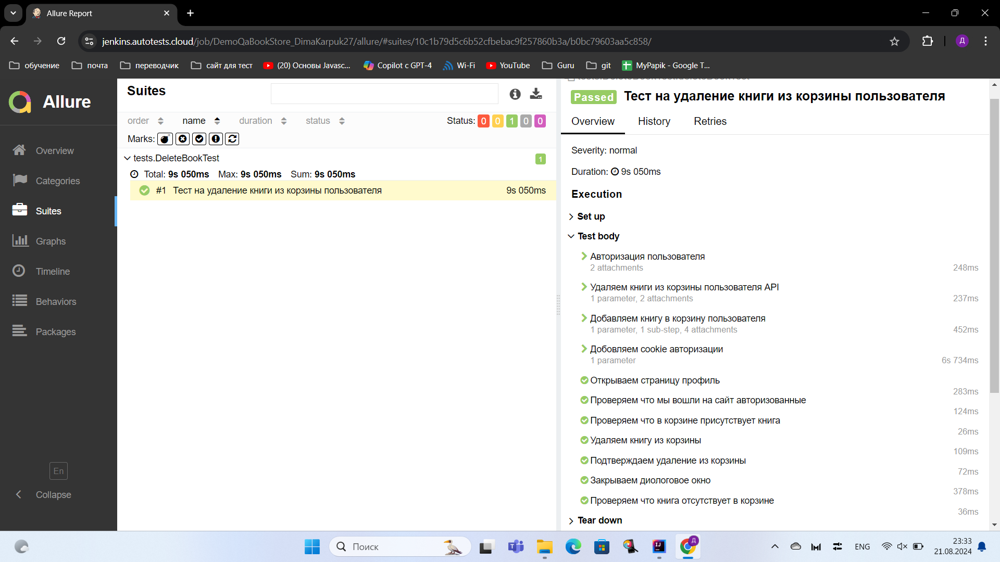
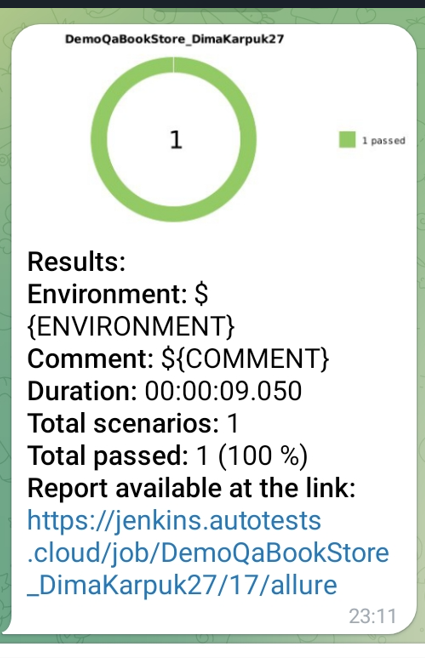

# Проект по автоматизации тестирования  [**demoqa.com**](https://demoqa.com/)

## **Содержание:**
____

* <a href="#tools">Технологии и инструменты</a>

* <a href="#cases">Описание автотеста для книжного магазина</a>

* <a href="#jenkins">Сборка в Jenkins</a>

* <a href="#console">Запуск из терминала</a>

* <a href="#allure">Allure отчет</a>

* <a href="#telegram">Уведомление в Telegram при помощи бота</a>

* <a href="#video">Примеры видео выполнения тестов на Selenoid</a>
____

<a id="tools"></a>
### Технологии и инструменты:

<p align="left">
<a href="https://allurereport.org/"></a>
<a href="https://gradle.org/"></a>
<a href="https://www.jetbrains.com/idea/"></a>
<a href="https://www.java.com/"></a>
<a href="https://www.jenkins.io/"></a>
<a href="https://junit.org/junit5/"></a>
<a href="https://selenide.org/"></a>
<a href="https://aerokube.com/selenoid/"></a>
</p>

<a id="cases"></a>
## <a name="UI + API автотесты для книжного магазина">** UI + API автотесты для книжного магазина:**</a>
____
- ✓ *API автотест авторизации*
- ✓ *API автотест добавления книги в корзину покупателя*
- ✓ *UI автотест удаление книги из корзины покупателя*

____
<a id="jenkins"></a>
## </a><a name="Сборка"></a>Сборка в [Jenkins](https://jenkins.autotests.cloud/job/DemoQaBookStore_DimaKarpuk27/)</a>
____
<p align="center">  
<a href="https://jenkins.autotests.cloud/job/DemoQaBookStore_DimaKarpuk27/"></a>  
</p>


### **Параметры сборки в Jenkins:**

- *BROWSER (браузер, по умолчанию chrome)*
- *BROWSER_VERSION (версия браузера, по умолчанию 122.0)*
- *BROWSER_SIZE (размер окна браузера, по умолчанию 1928x1080)*
- *SELENOID_URL (логин, пароль и адрес удаленного сервера Selenoid)*

<a id="console"></a>
## Команды для запуска из терминала
___
***Локальный запуск:***
```bash  
gradle clean
gradle parameterized_test
gradle jobSearch_test
gradle resume_test
```

___
<a id="allure"></a>
## </a> <a name="Allure"></a>Allure [отчет](https://jenkins.autotests.cloud/job/Intexsoft_KarpukD/12/allure/)</a>
___
### *Основная страница отчёта*

<p align="center">  
  
</p>  

### *Тест-кейсы*

<p align="center">  
  
</p>

____
<a id="telegram"></a>
## </a> Уведомление в Telegram при помощи бота
____
<p align="center">  
  
</p>

____
<a id="video"></a>
## </a> Примеры видео выполнения тестов на Selenoid
____
<p align="center">
   
</p>
