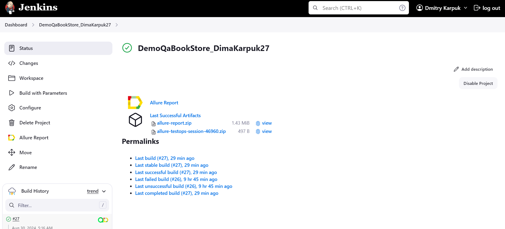
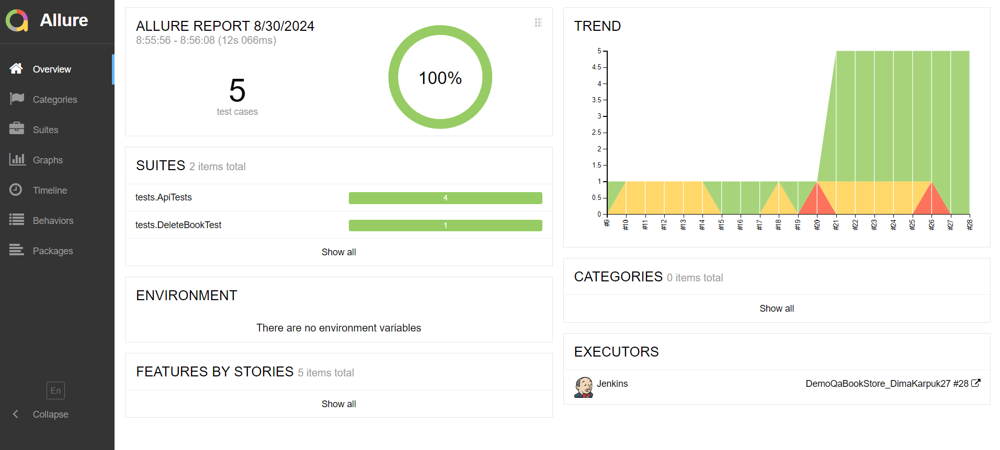
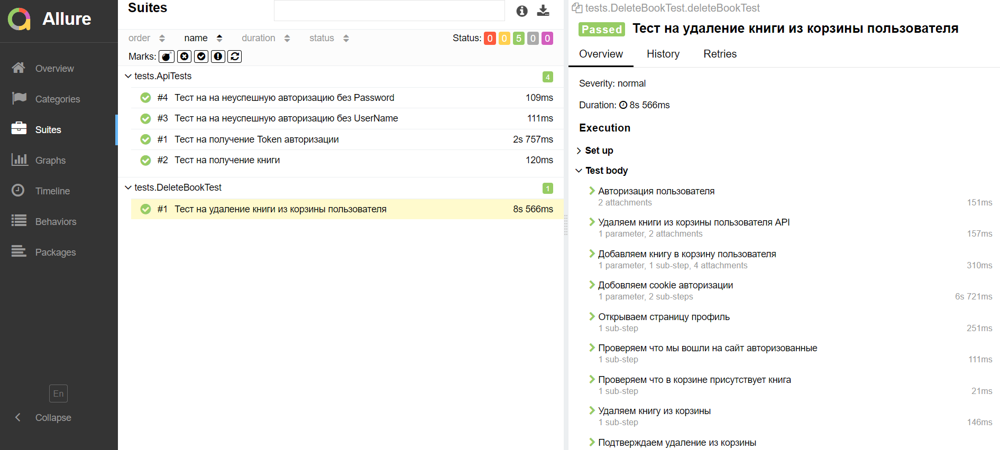
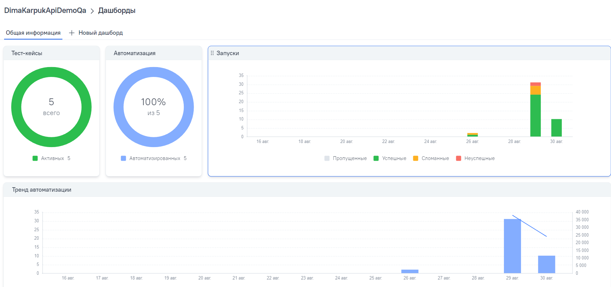
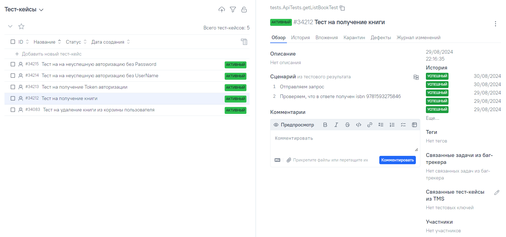
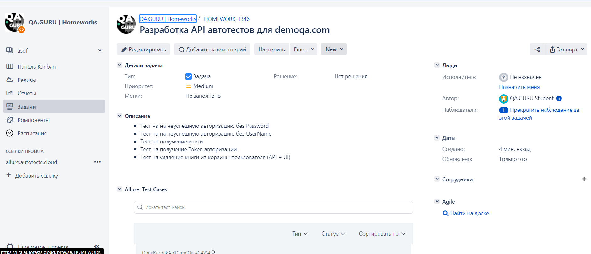
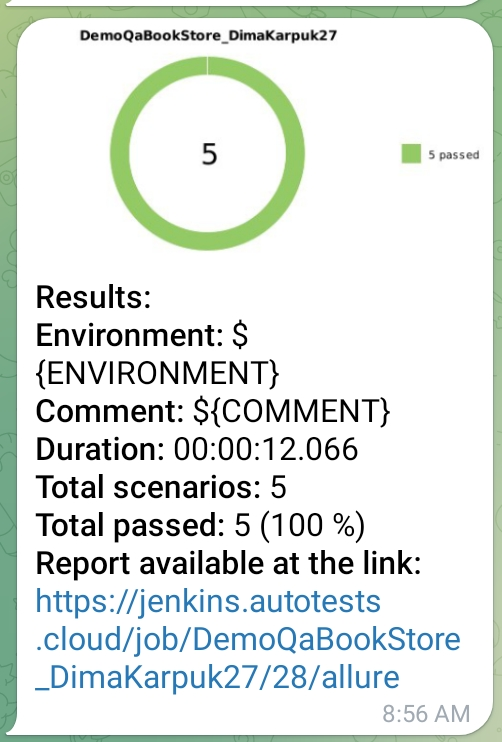
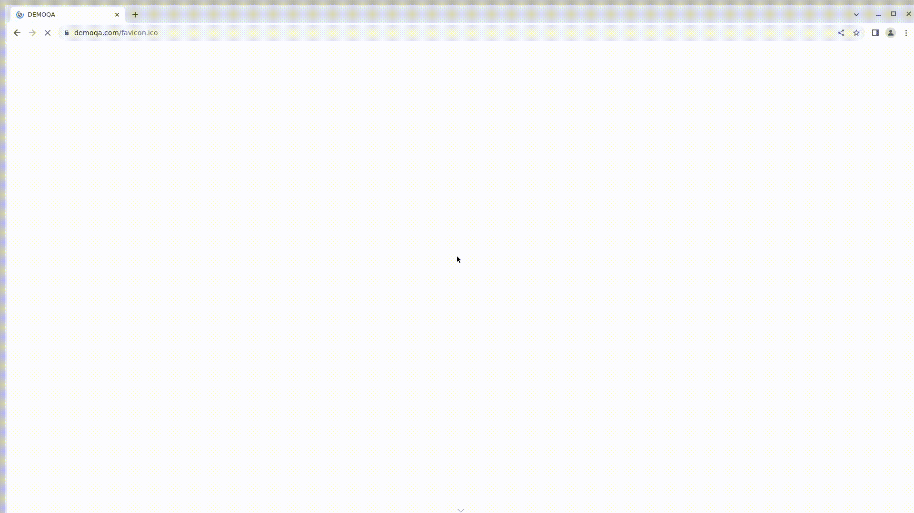

# Проект по автоматизации тестирования  [**demoqa.com**](https://demoqa.com/)

# 🧾 Содержание:
- <a href="#tools">Технологии и инструменты</a>
- <a href="#checking">Тестовые сценарии, реализованные в автоматизированных тест-кейсах</a>
- <a href="#jenkins">Сборка в Jenkins</a>
- <a href="#console">Запуск тестов (Из терминала)</a>
- <a href="#allureReport">Allure-отчет</a>
- <a href="#allure">Интеграция с Allure TestOps</a>
- <a href="#jira">Интеграция с Jira</a>
- <a href="#teleg"> Уведомление в Telegram о результатах выполнения автоматизированных тестов</a>
- <a href="#gif"> Пример видео запуска тестов</a>
---

- Тесты в данном проекте написаны на языке <code>Java</code> с использованием фреймворка для тестирования [Selenide](https://selenide.org/), c применением паттерна Page Object.
- Сборщик - <code>Gradle</code>.
- <code>JUnit 5</code> задействован в качестве фреймворка модульного тестирования.
- В отчетах Allure для каждого теста (запускаемого удаленно) прикреплено видео прохождения теста.
---

<a id="tools"></a>

## 🔨 Технологии и инструменты:

<p align="left">
<a href="https://www.atlassian.com/ru/software/jira">  </a>
<a href="https://allurereport.org/">  </a>
<a href="https://selenide.org/">  </a>
<a href="https://www.w3schools.com/java/">  </a> 
<a href="https://www.jetbrains.com/idea/">  </a> 
<a href="https://git-scm.com/">  </a> 
<a href="https://junit.org/junit5">  </a>
<a href="https://gradle.org">  </a>
<a href="https://www.jenkins.io">  </a>
<a href="https://www.atlassian.com/software/jira">  </a>
<a href="https://rest-assured.io/">  </a>
</p>

---
<a id="checking"></a>
## :clipboard: Тестовые сценарии

- [x] Негативный тест на авторизацию пользователя без password
- [x] Негативный тест на авторизацию пользователя без username
- [x] Тест на получение книги
- [x] Тест на получение token авторизации
- [x] Тест на удаление книги из корзины (Api + Ui)
---

<a id="jenkins"></a>
##  Сборка в [Jenkins](https://jenkins.autotests.cloud/job/DemoQaBookStore_DimaKarpuk27/)

<p align="center">

</p>

---

<a id="console"></a>
## :rocket: Команды для запуска

## Локальный запуск 

### Локальный запуск всех тестов
```bash
gradle clean test -DbrowserHost=local
```

### Локальный запуск API тестов
```bash
gradle clean apiTest -DbrowserHost=local 
```

### Локальный запуск ApiWithUi теста
```bash
gradle clean apiWithUiTest -DbrowserHost=local 
```

## Удаленный запуск (для запуска через selenoid нужно ввести адрес удаленного сервера)

### Удаленный запуск всех тестов
```bash
gradle clean test -DbrowserHost=remote 
-DremoteUrl= 
```
### Удаленный запуск API тестов
```bash
gradle clean apiTest -DbrowserHost=remote 
-DremoteUrl= 
```
### Удаленный запуск ApiWithUi теста
```bash
gradle clean apiWithUiTest -DbrowserHost=remote 
-DremoteUrl= 
```
---

<a id="allureReport"></a>
##  </a>Интеграция с <a target="_blank" href="https://jenkins.autotests.cloud/job/DemoQaBookStore_DimaKarpuk27/28/allure/">Allure Report</a>

## 🖨️ Основная страница отчёта

<p align="center">  
  
</p>  

## 📄 Тест-кейсы

<p align="center">  
   
</p>

---

<a id="allure"></a>
##  </a>Интеграция с <a target="_blank" href="https://allure.autotests.cloud/project/4407/dashboards">Allure TestOps</a>

## 🖨️ Основная страница отчёта

<p align="center">  
  
</p>  

## 📄 Авто тест-кейсы

<p align="center">  
  
</p>

---

<a id="jira"></a>
##  </a>Интеграция с <a target="_blank" href="https://jira.autotests.cloud/browse/HOMEWORK-1346">Jira</a>

##  В Jira создана задача

<p align="center">  
  
</p>

---

<a id="teleg"></a>
##  Уведомления в Telegram чат с ботом

### Уведомление через чат бот  

<p align="center">

</p>


#### Содержание уведомления в Telegram

- :heavy_check_mark: Окружение
- :heavy_check_mark: Комментарий
- :heavy_check_mark: Длительность прохождения тестов
- :heavy_check_mark: Общее количество сценариев
- :heavy_check_mark: Процент прохождения тестов
- :heavy_check_mark: Ссылка на Allure отчет
---

<a id="gif"></a>
####  Пример видео запуска тестов
<p align="center">
  
</p>
